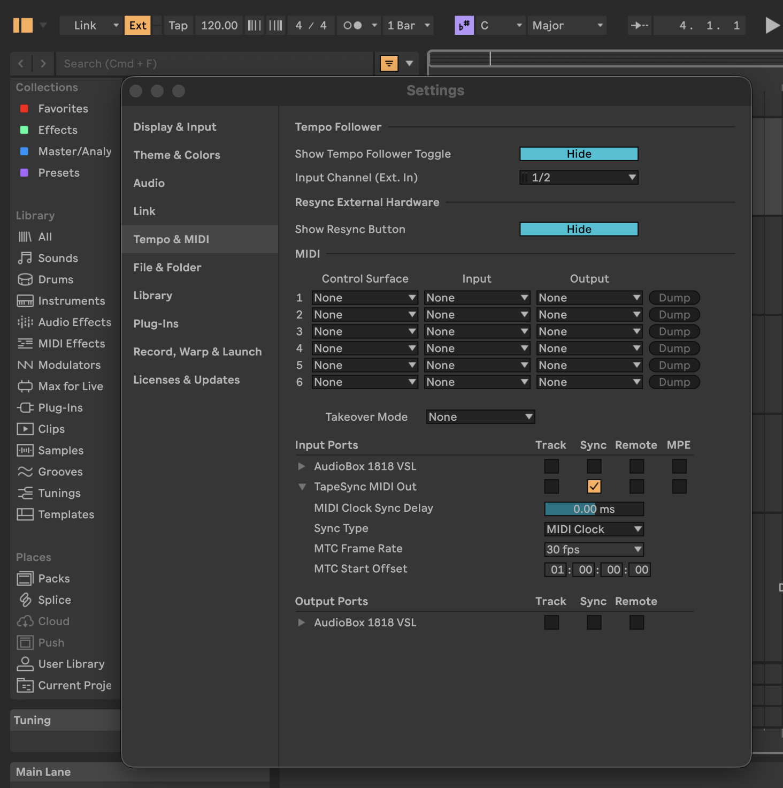

# Tape Sync TK

Tape Sync TK is a real-time tape-to-DAW synchronization tool.

It can run in two modes:

- Generate mode: emits SMPTE LTC audio so you can stripe tape with stable timecode.
- Decode mode: reads LTC from tape playback and drives your DAW by MIDI transport and MIDI clock.

The core goal is simple: during playback, tape is the timing master.

## What This App Is For

Tape Sync TK helps hybrid analog and digital setups where you want tape transport movement to control DAW timing.

Typical use cases:

- Stripe and chase workflow:
  - Print LTC to one tape track during setup.
  - Later play back tape and have DAW tempo and transport follow tape speed.
- Varispeed-aware sync:
  - Use tape speed changes creatively.
  - DAW clock follows decoded LTC rate so BPM scales with tape speed.
- Archival transfer with tempo follow:
  - Replay old striped tape sessions.
  - Keep DAW timeline and external MIDI devices aligned during transfer.
- Hardware-first sessions:
  - Let tape be the source of truth.
  - Keep software instruments and clocked hardware in sync via MIDI clock.

## Current Feature Set (MVP)

- LTC generator (bi-phase mark waveform) from configurable start timecode.
- LTC decoder with lock and direction state.
- Tempo recovery from measured LTC frame rate.
- MIDI Start, Stop, Continue, Song Position Pointer, and Clock emission.
- User-configurable latency compensation.
- Interactive terminal UI with persistent settings, device discovery, contextual help, and built-in defaults.
- Startup preflight checks for device and channel availability.

## Platform Notes

- This project is written in Rust.
- Virtual MIDI output is implemented for Unix targets. On macOS this works with CoreMIDI.
- Audio I/O is handled through CPAL and depends on host device support.

## Prerequisites

1. Install Rust toolchain (stable) with Cargo.
2. Ensure your system has usable audio input/output devices.
3. Ensure your DAW can receive MIDI clock and transport from a virtual MIDI port.

## Install

### Build from source

1. Clone this repository.
2. In the repository root, build release binary:

```bash
cargo build --release
```

3. Binary path:

- target/release/tape-sync-tk

### Optional: install into Cargo bin location

```bash
cargo install --path .
```

After this, you can run tape-sync-tk from your shell if Cargo bin is on PATH.

## Quick Start

### Run

From the repository, using the default settings path:

```bash
cargo run
```

After installing with Cargo, run:

```bash
tape-sync-tk
```

Using custom config path:

```bash
cargo run -- --config path/to/your-config.toml
```

The terminal menu lets you select Generate, Decode, Settings, or Quit. Main-menu number keys act immediately; arrow keys and Enter work throughout the UI. In longer lists, number keys select items 1 through 9 and arrows reach the remaining items. Use `Esc` or `b` to go back from an editor or running mode, and `q` or Ctrl-C to quit.

The startup screen shows the current audio routes and sample rate. Generate and Decode start immediately with their saved routes. Settings lists values in aligned columns and exposes every persisted option; selecting one shows its help directly on the editing screen. Choose Load Defaults to review its explanation and reset all settings. Changes are saved when a mode starts or the app quits.

If `tape-sync.toml` is missing or invalid, the app warns, loads built-in defaults, and assigns the first available input/output routes. Settings are saved to `tape-sync.toml`, or to the path passed with `--config`.

## Main tested Use Case: Tascam PortaStudio + Ableton Live

This is the primary real-world workflow used to validate Tape Sync TK end-to-end.

### Setup goal

Use a Tascam PortaStudio as the transport master and have Ableton Live chase tape via LTC decode and MIDI sync.

### Recommended routing

1. Reserve one PortaStudio track for LTC only (commonly track 4 or track 8).
2. Connect your audio interface output to the PortaStudio input used for striping LTC.
3. Connect the PortaStudio LTC playback output to your audio interface input channel configured in Tape Sync TK.

### Exact Ableton Live 12 settings

Tape Sync TK creates its virtual MIDI port only while Generate or Decode is running. Select Decode first and leave it running while configuring Live; Live can then discover the port and normally remembers it by name.

1. In Tape Sync TK Settings, use these MIDI values:
  - MIDI port name: `TapeSync MIDI Out`
  - Send MIDI clock: Enabled
  - Send MIDI transport: Enabled
  - Send MTC: Disabled
2. Select Decode so the virtual MIDI port exists.
3. In Live, open **Settings > Tempo & MIDI** (`Cmd+,` on macOS).
4. In **MIDI Ports**, select the input named `TapeSync MIDI Out` and set:
  - Sync: On. Some Live 12 revisions show this input setting as Sync to Live.
  - MIDI Sync Type: MIDI Clock, if the type chooser is shown.
  - Track: Off
  - Remote: Off
  - MPE: Off, if shown
  - Sync Delay: `0.00 ms` initially
5. Do not add Tape Sync TK as a Control Surface; it is a sync source, not a control surface.
6. Ensure Tempo Follower is Off. Tempo Follower and External Sync cannot receive tempo simultaneously.
7. Turn on **EXT** in Live's Control Bar. If it is not visible, enable the TapeSync sync input first; Live shows EXT when an external source is configured. The upper EXT indicator should flash when usable sync messages arrive.
8. Turn Live's Arrangement Loop switch Off while checking tape position. With Loop enabled, incoming Song Position Pointer values wrap into the loop region.



*Ableton Live 12 Tempo & MIDI settings with the TapeSync MIDI input configured as an external MIDI Clock source.*

Live accepts Tape Sync TK's MIDI Clock, transport, and Song Position Pointer in this setup. Do not choose MIDI Timecode: Tape Sync TK's Send MTC option is reserved and currently emits no MTC. See Ableton's [Synchronizing with Link, Tempo Follower, and MIDI](https://www.ableton.com/en/live-manual/12/synchronizing-with-link-tempo-follower-and-midi/) documentation for Live's external-sync behavior.

Tape Sync TK maps LTC `01:00:00:00` to MIDI Song Position Pointer zero, which is Live Arrangement position `1.1.1`. For the standard workflow, keep Timecode start at `01:00:00:00` and set Reference BPM to the desired Live tempo at normal tape speed.

Keep Live's Sync Delay at zero while setting Tape Sync TK latency. After the Tape Sync TK latency fields are calibrated, use either Live's Sync Delay or Tape Sync TK's Manual latency for final correction, not both, to avoid double compensation.

### Workflow

1. Open Settings and select the audio output used for striping and the audio input used for LTC playback.
2. Select Generate and record LTC to the dedicated PortaStudio track.
3. Press `Esc` or `b` to return to the menu, then rewind the tape.
4. Select Decode and configure Ableton Live as described above while Tape Sync TK keeps the virtual port open.
5. Start playback on the PortaStudio.
6. Tape Sync TK decodes LTC and emits MIDI SPP/transport/clock so Ableton Live follows tape position and speed.

### What to verify during testing

1. Lock state transitions to locked shortly after playback begins.
2. Ableton Live transport starts from decoded tape position after lock.
3. Clock remains stable during steady tape speed.
4. Varispeed changes on the PortaStudio produce matching tempo changes in Ableton Live.
5. Latency adjustments in [latency_ms] produce expected timing shifts.

## How To Use

### Generate mode (stripe tape)

Purpose: output LTC audio to a selected audio output/channel so you can record timecode onto tape.

1. In Settings, select the output device/channel routed to your tape track and configure the timecode start and LTC frame rate.
2. Return to the main menu and select Generate.
3. Record the generated LTC onto tape.
4. Press `Esc` or `b` to stop generation and return to the menu.

Tips:

- Keep LTC on a dedicated track.
- Avoid heavy processing on LTC path (EQ, compression, noise reduction) when possible.

### Decode mode (chase tape)

Purpose: read LTC from tape playback and emit MIDI sync for DAW/hardware.

1. Route LTC playback from tape into an audio input.
2. In Settings, select that input device/channel and configure reference tempo, decoder behavior, latency, and MIDI output options.
3. In your DAW, select the configured virtual MIDI port name and enable external sync/clock receive.
4. Return to the main menu and select Decode.
5. Start tape playback. Press `Esc` or `b` to stop decoding and return to the menu.

In decode mode, the app shows a live status line with lock state, direction, decoded frames, measured fps, and BPM estimate.

## Configuration Reference

The app stores settings as TOML at `tape-sync.toml` by default. Every persisted value is editable through Settings, so hand editing is not required. Generate and Decode are runtime choices and are not stored. Legacy `mode` keys are ignored.

Example shape:

```toml
[audio]
sample_rate = 44100
input_device = "Replace with an available input device"
input_channel = 0
output_device = "Replace with an available output device"
output_channel = 0

[timecode]
start = "01:00:00:00"
ltc_fps = 30.0

[tempo]
ref_bpm = 128.0
ref_fps = 30.0
smoothing_alpha = 0.15

[decode]
fps_estimate_window_frames = 12
dropout_reset_windows = 8

[latency_ms]
audio_output = 5.0
tape_path = 20.0
decoder = 10.0
manual = 0.0

[midi]
port_name = "TapeSync MIDI Out"
send_mtc = false
send_clock = true
send_transport = true
```

### Key fields

- audio.input_device/audio.input_channel: LTC playback source used by Decode; channels are zero-based.
- audio.output_device/audio.output_channel: LTC stripe destination used by Generate; channels are zero-based.
- audio.sample_rate: currently 44100 or 48000.
- timecode.start: HH:MM:SS:FF timecode start.
- timecode.ltc_fps and tempo.ref_fps: allowed values 24.0, 25.0, 29.97, 30.0.
- tempo.ref_bpm: reference BPM at reference speed.
- tempo.smoothing_alpha: 0.01 to 1.0.
- decode.fps_estimate_window_frames: 1 to 120.
- decode.dropout_reset_windows: 1 to 120.
- midi.port_name: virtual MIDI output name presented to other applications.
- midi.send_clock: enables MIDI Clock while Decode is locked and moving forward.
- midi.send_transport: enables SPP and Start/Continue/Stop messages.
- midi.send_mtc: reserved for future MIDI Time Code output; changing it currently has no runtime effect.
- latency_ms values:
  - audio_output: -500.0 to 500.0
  - tape_path: -500.0 to 500.0
  - decoder: -500.0 to 500.0
  - manual: -2000.0 to 2000.0

The app computes:

- total_latency_ms = audio_output + tape_path + decoder + manual

If absolute total latency exceeds 1000 ms, startup prints a warning.

## Expected Runtime Behavior

- On each return to the main menu, the app refreshes the system audio-device inventory.
- A saved route is retained while its named device/channel remains available. Otherwise the UI selects the first available route for that direction and channel 0.
- Generate requires an available output route; Decode requires an available input route. Startup preflight runs before opening audio and MIDI resources.
- Selecting an unsupported device/sample-rate combination fails with a related error.
- Returning from a running mode drops its audio and MIDI resources before showing the menu again.
- In decode mode:
  - lock acquisition sends MIDI Song Position Pointer, then Start at position zero or Continue at a nonzero position.
  - lock loss triggers Stop.
  - MIDI Clock is emitted only while locked and moving forward when send_clock is enabled.
  - reverse playback detection suppresses chase updates in MVP.

## Troubleshooting

### App says configured device was not found

- Return to the main menu to refresh device discovery.
- Open Settings and select a currently available input/output route.
- Ensure the device is connected and visible in operating-system audio settings.

### App says channel is unavailable

- Open Settings and reselect the device/channel; displayed channels are valid zero-based channels for that device.
- If the device changed while a mode was starting, return to the menu and try again.

### No DAW sync in decode mode

- Confirm the DAW is listening to the virtual port shown by MIDI port name in Settings.
- Confirm Send MIDI clock and Send MIDI transport are enabled.
- In Live's Tempo & MIDI Settings, confirm Sync is enabled for the TapeSync input and MIDI Sync Type is MIDI Clock.
- Confirm Live's EXT switch is on and its upper sync indicator flashes during locked tape playback.
- Turn Tempo Follower off; it prevents Live from receiving External Sync.
- Confirm LTC signal level and routing into configured input channel.
- MIDI Time Code is not emitted in the current MVP, even if Send MTC is enabled.

### Unstable lock

- Check tape signal quality and head alignment.
- Reduce processing/noise reduction on LTC path.
- Tune FPS estimate window and Dropout reset in Settings for your material.

### Timing feels offset

- Adjust the latency fields in Settings to align DAW events with tape playback.
- Set known audio, tape-path, and decoder delays first, then use Manual latency for final alignment.
- Automatic latency calibration is planned but not implemented; see Roadmap Notes.

## Development

Run tests:

```bash
cargo test
```

Run with default config:

```bash
cargo run
```

## Roadmap Notes

This is an MVP-focused engine. Non-goals currently include DAW-specific APIs, plugin formats, auto tempo-map extraction from arbitrary audio, and multi-machine tape chase.

### Interactive latency calibration

A future calibration wizard should estimate `[latency_ms]` values without requiring manual timing calculations:

1. Select calibration output and input routes.
2. Measure a direct audio-interface loopback baseline using emitted pulses and a known LTC sequence.
3. Repeat the measurement through the tape record/playback path.
4. Estimate decoder timing from the known LTC sample positions and separate tape-path delay from the direct-loopback baseline.
5. Run several passes, report median delay, jitter, and confidence, then preview suggested latency values.
6. Write the suggested settings only after explicit user confirmation.

The wizard should preserve `latency_ms.manual` for final DAW alignment. Audio-only calibration cannot determine every DAW, MIDI driver, or external-device delay; a later MIDI-loopback stage may cover those paths.

## License

This project is licensed under the MIT License.

See the LICENSE file for full text.
